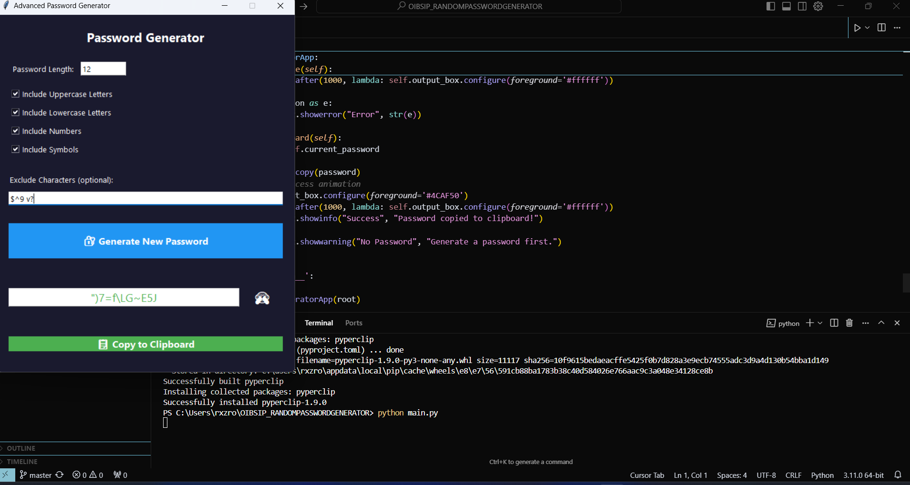

# 🔐 Advanced Password Generator

A modern, secure, and user-friendly password generator application built with Python and Tkinter. This application helps users create strong, customizable passwords with an intuitive graphical interface.

## 📸 Screenshot



## ✨ Features

- **Customizable Password Generation**
  - Adjustable password length
  - Option to include/exclude:
    - Uppercase letters
    - Lowercase letters
  - Numbers
    - Special symbolsg
  - Custom character exclusion

- **Enhanced Security**
  - Uses Python's `secrets` module for cryptographically strong random number generation
  - No password storage or logging
  - Secure clipboard handling

- **User-Friendly Interface**
  - Modern dark theme design
  - Intuitive controls
  - Real-time password visibility toggle
  - One-click password copying
  - Visual feedback for all actions

## 🛠️ Technical Stack

- Python 3.x
- Tkinter (GUI framework)
- secrets (Cryptographic random number generation)
- string (Character set handling)
- pyperclip (Clipboard management)

## 📋 Prerequisites

Before running the application, ensure you have the following installed:

```bash
pip install pyperclip
```

## 🚀 Installation

1. Clone the repository:
```bash
git clone https://github.com/ROSHNIFATIMA/OIBSIP_RANDOMPASSWORDGENERATOR.git
cd OIBSIP_RANDOMPASSWORDGENERATOR
```

2. Install the required dependencies:
```bash
pip install -r requirements.txt
```

3. Run the application:
```bash
python main.py
```

## 💻 Usage

1. **Set Password Length**
   - Enter your desired password length in the "Password Length" field
   - Minimum length: 4 characters

2. **Configure Character Sets**
   - Check/uncheck the boxes to include/exclude:
     - Uppercase letters (A-Z)
     - Lowercase letters (a-z)
     - Numbers (0-9)
     - Special symbols (!@#$%^&* etc.)

3. **Exclude Specific Characters (Optional)**
   - Enter any characters you want to exclude from the password

4. **Generate Password**
   - Click the "🔐 Generate New Password" button
   - The password will appear in the output field

5. **Manage Password Visibility**
   - Click the eye icon to toggle password visibility
   - 👁️: Password is hidden
   - 🙈: Password is visible

6. **Copy Password**
   - Click the "📋 Copy to Clipboard" button to copy the password
   - A confirmation message will appear

## 🔒 Security Features

- Passwords are generated using cryptographically secure random number generation
- No password history or storage
- Secure clipboard handling
- Option to exclude similar-looking characters
- Configurable password complexity

## 🎨 UI/UX Features

- Modern dark theme
- Responsive design
- Intuitive iconography
- Visual feedback for all actions
- Smooth animations
- Clear error messages

## 🤝 Contributing

Contributions are welcome! Please feel free to submit a Pull Request.

1. Fork the repository
2. Create your feature branch (`git checkout -b feature/AmazingFeature`)
3. Commit your changes (`git commit -m 'Add some AmazingFeature'`)
4. Push to the branch (`git push origin feature/AmazingFeature`)
5. Open a Pull Request


Developed by FATHIMA ROSHINI SIYAD